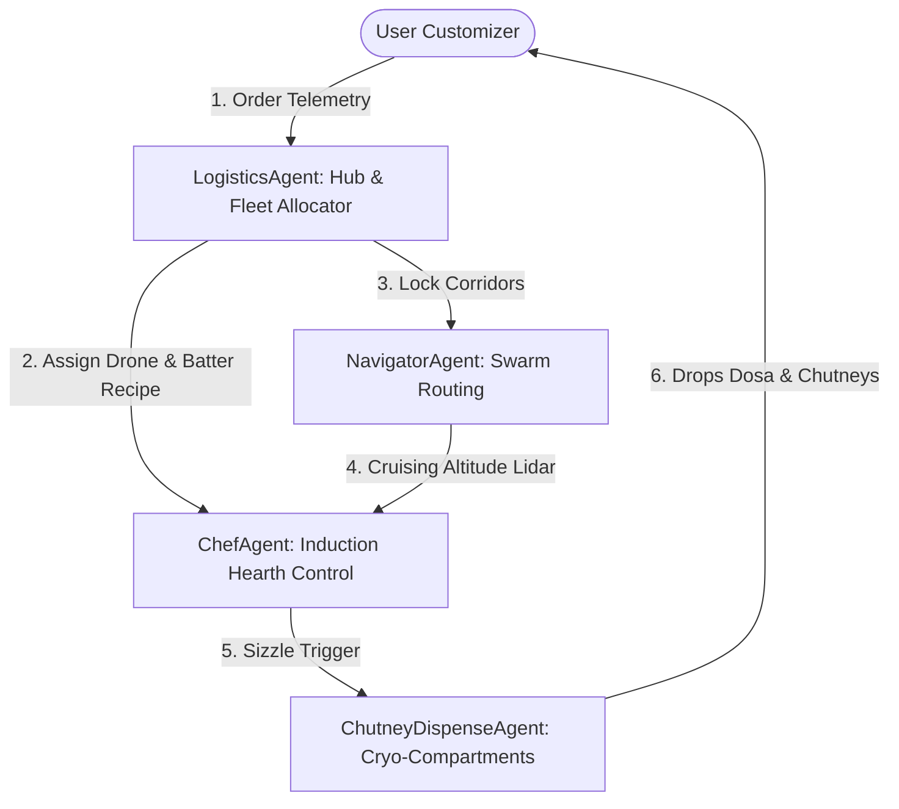

# AirDosa Multi-Agent Swarm Architecture

The AirDosa service is powered by an autonomous, collaborative **Multi-Agent Swarm** that handles the end-to-end lifecycle of every dosa — from the millisecond the order is received to the zero-impact balcony landing. 

Here is the operational breakdown of the four specialized AI agents coordinating within the AirDosa aerospace grid.

---

## 1. ChefAgent: Thermal & Induction Cooker
* **Primary Role**: Real-time baking optimization and crispiness control.
* **Core Neural Net**: Convolutional Thermal Net (CTN).
* **Operational Profile**:
  * **Batter Viscosity Analysis**: Inspects batter thickness and moisture index via electromagnetic friction sensors inside the drone's cooking chamber before flight.
  * **Adaptive Induction Cooking**: Dynamically adjusts induction coil frequencies ($18\text{ kHz}$ to $24\text{ kHz}$) based on real-time atmospheric humidity and air pressure changes as the drone gains altitude.
  * **Crunch Index ($CI$) Verification**: Uses internal acoustic microphones to analyze the crackle frequency of the roasting crust, ensuring the dosa hits exactly $98\%$ crispiness $30\text{ seconds}$ before target arrival.

---

## 2. NavigatorAgent: Flight Vectoring & Avoidance
* **Primary Role**: Safe trajectory routing, wind vector counter-thrust, and avian collision avoidance.
* **Core Neural Net**: Deep Q-Network for Continuous Airspace Control.
* **Operational Profile**:
  * **Micro-routing Coordinates**: Maps high-precision, sub-50 meter altitudes using 3D-LiDAR and real-time RTK-GPS grids to avoid power lines and high-rise balconies.
  * **Avian Redirect Pulses**: Detects nearby birds up to $50\text{ meters}$ away and uses directed, non-harmful acoustic waves to safely reroute birds away from the flight path.
  * **Wind Gust Compensation**: Real-time stabilization algorithms coordinate active counter-thrust against Bengaluru’s erratic pre-monsoon crosswinds, preventing batter skewing during mid-air baking.

---

## 3. LogisticsAgent: Hub Coordinator & Queue Allocator
* **Primary Role**: Fleet optimization, battery thermal management, and launchpad queue logistics.
* **Core Neural Net**: Multi-Agent Reinforcement Learning (MARL) for Spatial Allocation.
* **Operational Profile**:
  * **Drone Dispatch Scheduling**: Allocates incoming orders to drones stationed at the nearest vertical launchpads (e.g., Indiranagar, HSR, Whitefield) based on launch pad load.
  * **Battery Health & Regeneration**: Coordinates automated drone battery swaps at vertical hubs and calculates regenerative glide paths to maximize battery charge.
  * **Thermal Vault Logistics**: Manages the temperature thresholds of sambar heating bays ($80^\circ\text{C}$) and cryogenic chutney pods ($4^\circ\text{C}$) before drone integration.

---

## 4. ChutneyDispenseAgent: Pressurized Payload Release
* **Primary Role**: Millisecond-accurate landing release and cryo-vault cargo seals.
* **Core Neural Net**: Precision Mechanical Physics Predictor.
* **Operational Profile**:
  * **Nitrogen Isolation Guard**: Maintains liquid nitrogen isolation seals, keeping standard coconut and tomato chutneys fresh and separated from the adjacent $200^\circ\text{C}$ induction hearth.
  * **Altitude Deceleration Drop**: Coordinates with the landing LiDAR to calculate the exact millisecond to open the bottom drop bay doors for a zero-impact payload hover drop onto the user's plate.
  * **Pressurized Air Curtain**: Blows a hydrophobic, high-pressure air barrier around the food during drop-release to prevent humidity and rain from compromising the crust.
